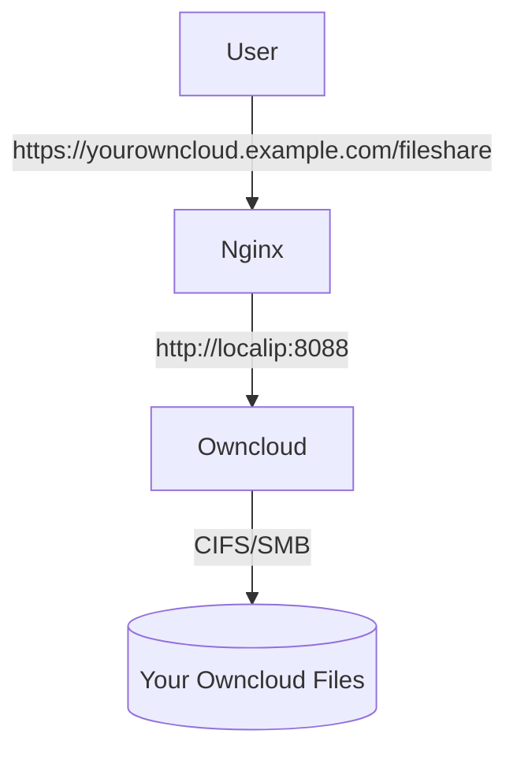

# Owncloud on RPI
Instructions for how to set up a Owncloud instance on Docker using a Raspberry Pi.

Target: `arm32 based Raspberry Pi 3B running Raspbian. 1 GB ram.`



## Docker
Install Docker on the Pi [Link](https://www.simplilearn.com/tutorials/docker-tutorial/raspberry-pi-docker)

## Portainer
Install Portainer to manage Docker containers. [Link](https://docs.portainer.io/v/ce-2.9/start/install/server/docker/linux)

## Owncloud
### Volumes
>**Note:** This guide assumes you have a SAMBA file share on the local network. This share will be used to store the Owncloud files.

Create the volume. Run below in the command line:
```bash
docker volume create -d local --opt type=cifs --opt device=//192.168.1.1/<<PATH TO YOUR SHARE>> --opt 'o=addr=192.168.1.1,username=<<USERNAME>>,password=<<PASSWORD>>,vers=2.0,uid=33,forceuid,file_mode=0770,dir_mode=0770' owncloud_custom_files_noperm
```
> **Note:** The container uses `uid=33` as the `www-data` user. Permissions will not work if this is not added.

### Stack
In Portainer Stacks, deploy the Docker file in `./owncloud`. Change the environment username/password. This stack was modified from [Owncloud's install](https://doc.owncloud.com/server/next/admin_manual/installation/docker/) to run on arm32.

The Owncloud web-server will now run at `http://localhost:8088`

## Nginx Proxy Manager
Nginx will serve as the https front-end for external clients.

### Volumes
There are no volumes for this container. Data paths are binded directly to the host-filesystem. This guide puts the container's `data` and `letsencrypt` folders in the home directory of your host user. The path is configured in the environment variable.

### Stack
In Portainer Stacks, deploy the Docker file in `./nginx-proxy-manager`.

The Nginx admin panel will now be accessible at `http://localhost:81`. The front-end of the Nginx server will now be accessible at `http://localhost:80` and `https://localhost:443`.

### Proxy Configuration
Navigate to the Nginx admin panel. 

#### Create an SSL cert
Create a cert for your hostname. 

#### Create a new host:
```
**Details**
Domain Names: <your domain>
Scheme: http
Forward Hostname: your RPI's internal IP address or hostname
Forwarded Port: 8088
Block Common Exploits: True

**SSL**
SSL Certificate: <your cert>
Force SSL: True
HSTS Enabled: True

**Advanced**
Custom Nginx config: See below. This will block the redirect from the root host to Owncloud. This will limit access from crawlers and bots as they will need to know the full server path.
    location =/ {
        return 403;
    }
```

## ddclient
ddclient is  a dynamic dns (DDNS) service to update the IP address for your hostname.

### Volumes
There are no volumes for this container. Data paths are binded directly to the host-filesystem. This guide puts the container's data in the home directory of your host user, under the `ddclient` folder.

### Stack
In Portainer Stacks, deploy the Docker file in `./ddclient`.

### Config
ddclient needs to connect to your DNS registrar to update the IP records. This documentation uses Namecheap as a guide.

Navigate to `~/ddclient` on your RPI and open `ddclient.conf`. Change the setting for Namecheap to below. Only change things in <\<brackets\>>

```
##
## NameCheap (namecheap.com)
##
 use=web, web=dynamicdns.park-your-domain.com/getip
 protocol=namecheap,                            \
 server=dynamicdns.park-your-domain.com,        \
 login=<<example.org>>,                                 \
 password=<<pwd>>      \
 <<subdomain, e.g. www>>

```
